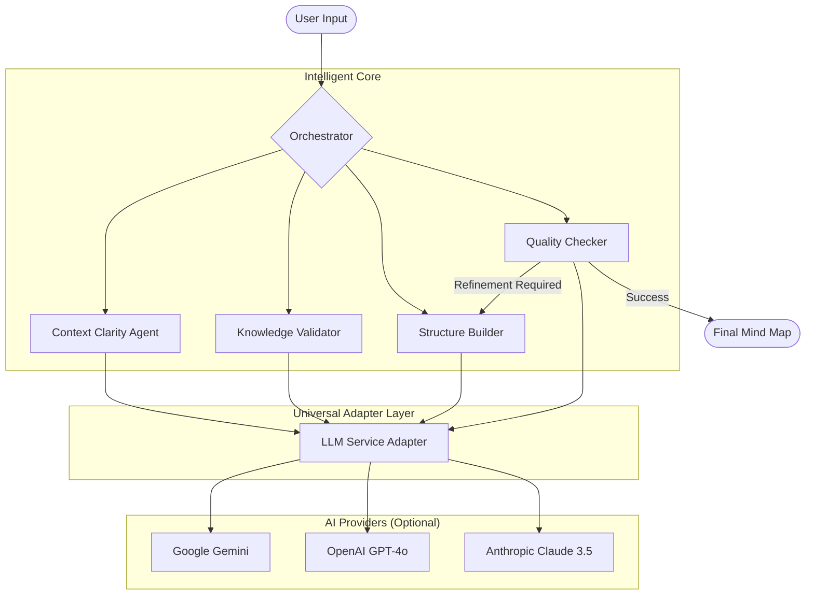

# Agent Logic & Workflow

## Architecture Diagram

The system uses a modular, provider-agnostic architecture. The **Orchestrator** manages the state machine, while the **LLM Service** acts as a universal bridge to various AI providers.

---

## Workflow Instructions

Each agent follows a specific set of prompts designed to ensure high-quality output:

### 1. Context Clarity Agent (The Listener)
*   **Role**: To prevent "garbage in, garbage out" by ensuring the topic is specific.
*   **How it works**: It analyzes the prompt for ambiguity. If you say "Cars", it asks if you want the history of cars, how engines work, or a list of top brands.
*   **Goal**: It won't let the "Construction" phase start until the topic is sharp enough to build a meaningful map.

### 2. Knowledge Validator Agent (The Truth-Seeker)
*   **Role**: To prevent "Hallucinations" (AI making things up).
*   **How it works**: It checks its own internal confidence about the topic. If the topic is extremely recent (post-Jan 2025) or highly niche, it warns you.
*   **Goal**: To manage user expectations and ensure the AI doesn't confidently provide outdated or false info.

### 3. Structure Builder Agent (The Architect)
*   **Role**: To design the hierarchical tree.
*   **How it works**: It takes the clarified topic and applies "Systematic Decomposition". It uses past **Learnings** (from previous runs) to avoid repeating structural mistakes.
*   **Goal**: To create a MECE (Mutually Exclusive, Collectively Exhaustive) structure that fits your requested depth.

### 4. Quality Checker Agent (The Critic)
*   **Role**: To ensure the final product meets "Enterprise Grade" standards.
*   **How it works**: It looks at the builder's output and scores it against three pillars (Completeness, Accuracy, Balance).
*   **Goal**: It provides the "Suggestions" you see in the sidebar and triggers the **Refinement Loop** if the structure isn't perfect.

---

## The Scoring System

### Why is it there?
Without a scoring system, an AI agent system is just a "black box". The scoring system provides **transparency and accountability**. It allows the Orchestrator to decide—mathematically—if the output is good enough to show to you, or if it needs to go back to the drawing board for a refinement.

### How it works:
Every mindmap is graded out of 100 points, calculated as an average of three metrics:

1.  **Completeness (Breadth)**: Does the map cover the 3-5 most critical pillars of this topic? If a map about "France" misses "Geography" or "Culture", it gets a low score here.
2.  **Accuracy (Logic)**: Are the sub-nodes actually children of their parents? If "Apples" is listed under "Vegetables", the accuracy score drops.
3.  **Balance (Structure)**: Is one branch 10 levels deep while another is empty? Good mindmaps are balanced for readability.

### The "Loop" Trigger:
If the average score is **under 90%**, the system automatically re-runs the Builder. It tells the Builder: *"Hey, the previous attempt scored low on Balance. Here is a suggestion: divide the second branch into more sub-parts."*

---

## Optional Configuration
*   **Custom Models**: By default, we use Google Gemini. However, the system is designed for power users who want to use their own models (Claude, GPT-4o).
*   **API Keys**: You can provide your own key to bypass quota limits. These keys are used only for your current session and are never stored.
